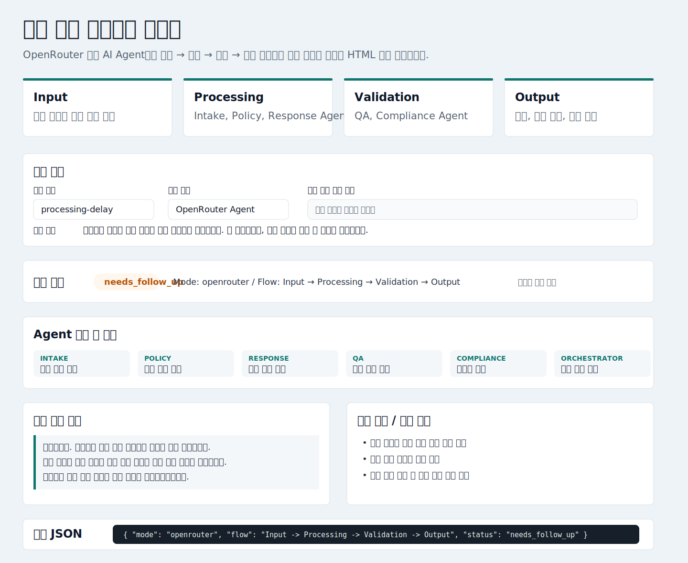

# 민원 멀티 에이전트 하네스

`revfactory/harness`의 핵심 관점인 역할 분리, 오케스트레이션, 검증 게이트, 실행 결과 관찰 방식을 참고해 만든 민원 처리용 AI 멀티 에이전트 하네스입니다.

이 프로젝트는 pixel-agent나 캐릭터 중심 구조를 제거하고, AI Agent가 민원 업무를 어떻게 나누어 처리하는지 보여주는 데 집중합니다. HTML 화면에서 민원을 입력하면 `Input -> Processing -> Validation -> Output` 흐름으로 Agent 실행 결과를 확인할 수 있습니다.



## 하네스 주제

민원 처리 업무를 위한 AI 멀티 에이전트 하네스

## 구성 목적

- 민원 내용을 AI Agent별 업무 단위로 분해합니다.
- 접수 분석, 처리 기준 검토, 답변 작성, 품질 검증, 컴플라이언스 검토를 분리합니다.
- 각 Agent는 OpenRouter 모델을 통해 실행되며, 하네스는 로컬 Node.js 서버에서 전체 순서를 오케스트레이션합니다.
- 검증 Agent의 결과가 최종 상태와 후속 조치에 반영되도록 구성합니다.
- HTML 화면에서 민원 입력, 실행 상태, Agent별 결과, 시민 답변 초안, 검증 로그, JSON 결과를 한 번에 확인할 수 있게 합니다.
- 실제 정보가 없는 접수 이력은 자동으로 만들지 않고, 사용자가 입력한 참고 정보만 처리에 사용합니다.

## 전체 구조

```text
Input
  - 민원 유형
  - 민원 내용
  - 참고 정보 선택 입력
  - 실행 모드

Processing
  - Intake Agent: 민원 요약, 핵심 쟁점 추출, 부족 정보 식별
  - Policy Agent: 처리 기준, 필요 증빙, 리스크 기준 정리
  - Response Agent: 시민 답변 초안과 내부 메모 작성
  - Orchestrator: Agent 실행 순서 제어와 산출물 연결

Validation
  - QA Agent: 답변 품질, 누락 쟁점, 사실 확인 필요 항목 검증
  - Compliance Agent: 단정 표현, 개인정보, 정책 리스크 검토

Output
  - 실행 상태
  - Agent별 처리 결과
  - 시민 답변 초안
  - 검증 로그
  - 후속 조치
  - 결과 JSON
```

## Agent 구성

| Agent | 역할 | 주요 출력 |
| --- | --- | --- |
| Intake Agent | 민원을 접수하고 핵심 쟁점을 구조화 | 요약, 쟁점, 부족 정보 |
| Policy Agent | 처리 기준과 답변 원칙 정리 | 기준, 필요 증빙, 리스크 |
| Response Agent | 시민 답변과 내부 메모 생성 | 답변 초안, 내부 메모 |
| QA Agent | 누락, 사실 확인 필요 항목, 품질 검증 | 체크 결과, 수정 필요 항목 |
| Compliance Agent | 표현과 정책 리스크 확인 | 리스크 등급, 검토 의견 |
| Orchestrator | 전체 실행 순서와 산출물 연결 | 최종 결과 객체 |

## 프로젝트 구조

```text
minwon-multi-agent-harness/
  index.html                 # HTML 실행 화면
  package.json               # 실행 스크립트
  README.md                  # 프로젝트 설명 문서
  .env.example               # OpenRouter 환경 변수 예시
  src/
    server.js                # HTML 제공 및 /api/run API 서버
    minwon-harness.js        # Agent 정의, OpenRouter 호출, 오케스트레이션
    minwon-harness.test.js   # 하네스 기본 검증 테스트
```

## 사용 방법

### 1. OpenRouter 환경 변수 설정

`.env.example`을 참고해 `.env` 파일을 만들고 OpenRouter API 키와 모델을 설정합니다.

```text
OPENROUTER_API_KEY=your_openrouter_api_key_here
OPENROUTER_MODEL=google/gemma-4-31b-it
OPENROUTER_SITE_URL=http://localhost:3100
OPENROUTER_APP_NAME=Minwon Multi Agent Harness
```

### 2. HTML 하네스 서버 실행

```shell
npm run serve
```

서버가 실행되면 브라우저에서 아래 주소를 엽니다.

```text
http://localhost:3100
```

### 3. HTML에서 하네스 실행

1. `민원 유형`을 입력합니다.
2. `민원 내용`에 처리할 민원을 입력합니다.
3. 실제 접수일, 담당 부서, 이전 답변 같은 정보가 있을 때만 `참고 정보 선택 입력`에 적습니다.
4. `실행 모드`를 `OpenRouter Agent`로 둡니다.
5. `하네스 실행` 버튼을 누릅니다.

OpenRouter 호출은 여러 Agent를 순차 실행하므로 보통 20~90초 정도 걸릴 수 있습니다. API 키가 없거나 빠른 구조 확인만 필요하면 `Local fallback` 모드를 선택할 수 있습니다.

## 터미널 실행

로컬 fallback 데모 실행:

```shell
npm run demo
```

OpenRouter Agent 데모 실행:

```shell
npm run demo:openrouter
```

테스트 실행:

```shell
npm run test
```

## HTML 실행 결과 예시

아래 이미지는 GitHub README에서 바로 확인할 수 있는 HTML 화면 예시입니다. 입력 민원, 실행 상태, Agent 처리 결과, 시민 답변 초안, 검증 로그가 함께 표시됩니다.


현재 HTML 화면에서 하네스를 실행하면 다음 영역들이 채워집니다.

```text
민원 입력
- 민원 유형: processing-delay
- 민원 내용: 지난달에 제출한 민원 신청이 아직 처리되지 않았습니다. 왜 지연되는지, 언제 답변을 받을 수 있는지 알려주세요.
- 참고 정보 선택 입력: 비워 둠
- 실행 모드: OpenRouter Agent

실행 상태
- 상태: needs_follow_up
- Mode: openrouter
- Flow: Input -> Processing -> Validation -> Output

Agent 구성 및 결과
- Intake Agent: 민원 지연 문의를 요약하고 핵심 쟁점과 부족 정보를 추출
- Policy Agent: 처리 기준, 확인해야 할 자료, 답변 시 주의할 표현 정리
- Response Agent: 시민에게 보낼 답변 초안과 내부 처리 메모 작성
- QA Agent: 구체적인 처리 예정일 또는 담당 부서 확인 필요 여부 검증
- Compliance Agent: 개인정보, 단정 표현, 정책 리스크 검토
- Orchestrator: 각 Agent 산출물을 연결해 최종 결과 구성

시민 답변 초안
안녕하세요. 문의하신 민원 처리 지연으로 불편을 드려 죄송합니다.
현재 정확한 처리 단계와 예상 답변 일자는 담당 부서 확인이 필요한 항목입니다.
확인되는 즉시 처리 현황과 향후 일정을 안내드리겠습니다.

검증 로그 / 후속 조치
- 담당 부서의 최신 처리 상태 확인 필요
- 실제 답변 예정일 확인 필요
- 시민 답변 발송 전 구체 정보 보강 필요
```

HTML 하단의 `결과 JSON` 영역에는 같은 실행 결과가 구조화된 객체로 표시됩니다.

```json
{
  "harness": "Complaint Multi-Agent Harness",
  "mode": "openrouter",
  "flow": "Input -> Processing -> Validation -> Output",
  "output": {
    "status": "needs_follow_up",
    "citizenReply": "안녕하세요. 문의하신 민원 처리 지연으로 불편을 드려 죄송합니다...",
    "validationLog": [
      {
        "name": "qa-specificity",
        "passed": false,
        "detail": "실제 처리 예정일은 담당 부서 확인 후 보강이 필요합니다."
      },
      {
        "name": "compliance",
        "passed": true,
        "detail": "개인정보 노출이나 정책 위반 표현은 발견되지 않았습니다."
      }
    ],
    "nextActions": [
      "담당 부서의 최신 처리 상태 확인",
      "실제 답변 예정일 확인",
      "시민 답변 발송 전 구체 정보 보강"
    ]
  }
}
```

## 하네스 실행 방식

AI Agent는 OpenRouter 모델로 실행됩니다. 하네스 자체는 로컬 Node.js 서버가 담당합니다.

```text
Browser HTML
  -> POST /api/run
  -> Node.js Harness Orchestrator
  -> OpenRouter Agent calls
  -> Validation Gate
  -> Final Output JSON
  -> HTML Render
```

즉, OpenRouter는 Agent의 판단과 생성 작업을 수행하고, 로컬 하네스는 입력 수집, 실행 순서 제어, 검증 결과 취합, HTML 렌더링을 담당합니다.


